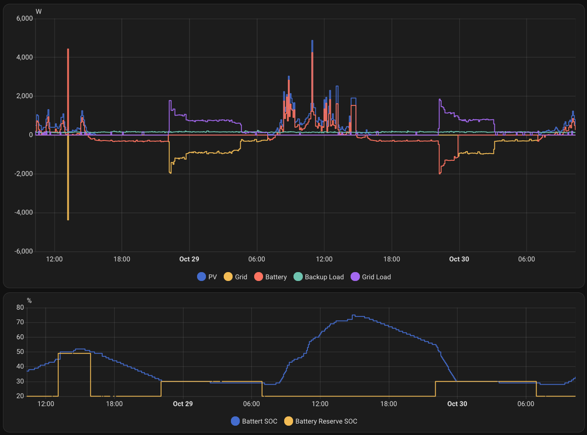
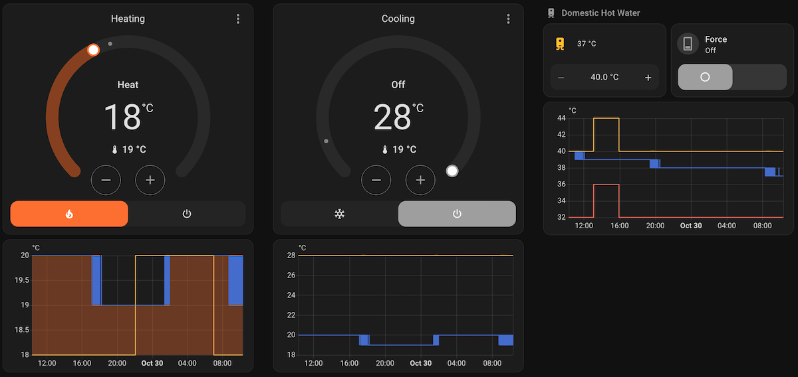

# Home Assistant AppDaemon Applications

This project provides intelligent automation for solar-powered homes, optimizing energy usage and battery management to maximize self-consumption and minimize grid costs.
By integrating real-time solar production data, household consumption patterns, weather forecasts, and dynamic electricity pricing, the system makes autonomous decisions about when to store, consume, or discharge battery energy.

Additionally, it provides smart HVAC control for heating, cooling, and domestic hot water (DHW) management with eco-mode support and time-based temperature boosting.

## Features

### Solar Energy Optimization

- *Battery Reserve Management* - Dynamically adjusts battery reserve SOC to prevent grid import during high-tariff periods
- *Storage Mode Optimization* - Automatically determines the optimal hybrid inverter storage mode to maximize PV energy sales to the grid
- *Discharge Slot Optimization* - Calculates optimal battery discharge windows to maximize earnings from grid energy sales

### HVAC Control

- *Domestic Hot Water (DHW) Management* - Intelligent temperature control with eco-mode support and solar-aligned boost periods
- *Heating Temperature Control* - Dynamic heating setpoint adjustment based on eco-mode and configurable boost windows
- *Cooling Temperature Control* - Automatic cooling setpoint adjustment based on eco-mode and configurable boost windows

## Architecture

The project follows a clean architecture pattern with clear separation of concerns:

### Solar Module

- `apps/solar_app.py` - AppDaemon integration layer for Solar control that wires dependencies and handles framework interactions
- `apps/solar/` - Core solar-related business logic isolated from the AppDaemon framework
  - `solar.py` - Main solar orchestration logic
  - `*_estimator.py` - Specialized estimators for energy usage and battery management decisions
  - `*_forecast.py` - Forecast data models and factories
  - `state.py` / `state_factory.py` - Home Assistant state management

### HVAC Module

- `apps/hvac_app.py` - AppDaemon integration layer for HVAC control that wires dependencies and handles framework interactions
- `apps/hvac/` - Core HVAC-related business logic isolated from the AppDaemon framework
  - `hvac.py` - Main HVAC orchestration logic
  - `*_estimator.py` - Specialized estimators for temperature management
  - `state.py` / `state_factory.py` - Home Assistant state management

### Shared Components

- `apps/entities/` - Home Assistant entity constants
- `apps/units/` - Type-safe value objects for domain concepts (energy, power, battery SoC, temperature, etc.)
- `apps/utils/` - Shared utilities including safe type converters, battery estimators, and HVAC estimators
- `apps/appdaemon_protocols/` - Protocol interfaces for dependency injection and testability

## Design Principles

- *Dependency Injection* - Protocol classes enable testing without the AppDaemon runtime
- *Immutable Data* - Frozen dataclasses prevent accidental state mutations
- *Type Safety* - Full type hints enforced by ruff and pyright configurations
- *Testability* - Core logic is framework-agnostic and easily unit-testable

## Configuration

Applications are configured in `apps/apps.yaml`. See configuration files for available options:

### Solar Configuration (`apps/solar_app.py`)

- Battery capacity, voltage, and current limits
- SOC reserve thresholds and margins
- Heating system COP and thermal coefficients
- Fallback values for sensor failures

### HVAC Configuration (`apps/hvac_app.py`)

- DHW, heating, and cooling temperature setpoints (normal and eco modes)
- Temperature boost deltas for each mode
- Time windows for temperature boosting
- Eco-mode scheduling

## References

- [Home Assistant solar automation prototype](https://mkuthan.github.io/blog/2025/04/12/home-assistant-solar/)
- [Solis Cloud Control integration](https://github.com/mkuthan/solis-cloud-control)
